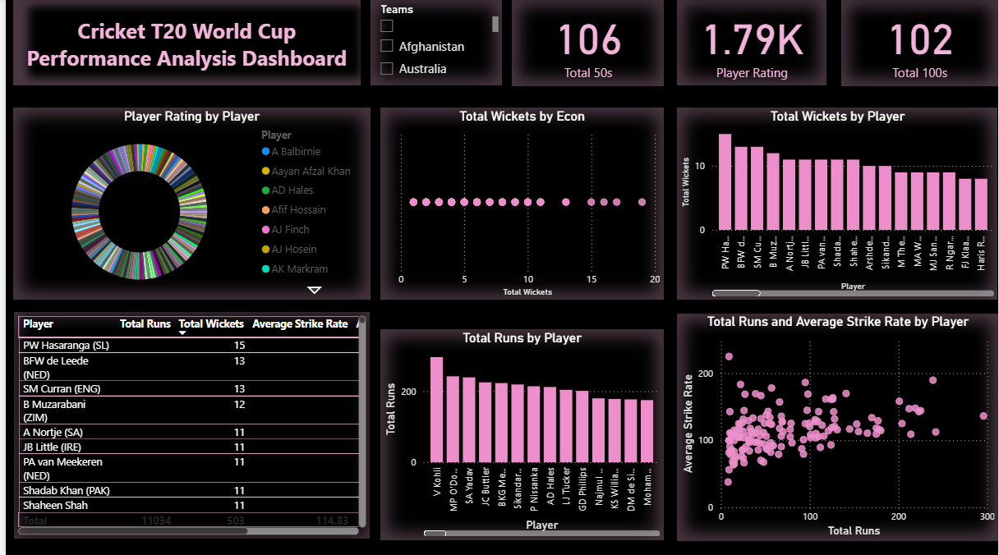

# T20 World Cup Player Performance Dashboard  

## Problem Statement  
- Analyze T20 World Cup player performance data  
- Build a dashboard to show:  
  - Runs, Wickets, Strike Rate, Economy  
  - Player comparisons  
  - Filters (Team, Role, Year/Span)  
 
### 1. Data Collection (Web Scraping)  
- Source: ESPN Cricinfo  
- Tool: Bright Data Web Scraper  
- Scraped 5 CSV files:  
  - Best Economy  
  - Bowling Best Figures  
  - Highest Strike Rates  
  - Most Runs  
  - Most Wickets  

### 2. Data Cleaning (Python + Pandas)  
- Removed extra spaces  
- Replaced "-" with NaN  
- Converted numeric columns to float/int  
- Exported cleaned CSVs  

### 3. Data Transformation (Power Query in Power BI)  
- Refined columns  
- Set correct data types  
- Kept only relevant columns  

### 4. Player Master Table (Power Query)  
- Created reference queries for Player column  
- Appended into one table  
- Removed duplicates  
- Final table: **Players**  

### 5. Data Modeling & DAX (Power BI)  
- Relationships built:  
  - Players ↔ Most Runs  
  - Players ↔ Most Wickets  
  - Players ↔ Best Economy  
  - Players ↔ Highest Strike Rate  
**- DAX Measures created: ** 
  - Total Runs  
  - Total Wickets  
  - Average Strike Rate  
  - Bowling Economy  
  - Player Rating  

### 6. Dashboard Building (Power BI)  
- **Bar Chart** → Top Batsmen (Players vs Runs)  
- **Bar Chart** → Top Bowlers (Players vs Wickets)  
- **Scatter Plot** → Runs vs Strike Rate  
- **Scatter Plot** → Wickets vs Economy  
- **Pie Chart** → Top 5 Players Contribution  
- **Table** → Player Rating Comparison  
- **Filters / Slicers** → Team, Span, Role  

## Tech Stack  
- Web Scraping → Bright Data  
- Data Cleaning → Python (Pandas)  
- Data Transformation → Power BI (Power Query + DAX)  
- Visualization → Power BI  

##  Dashboard Preview  

